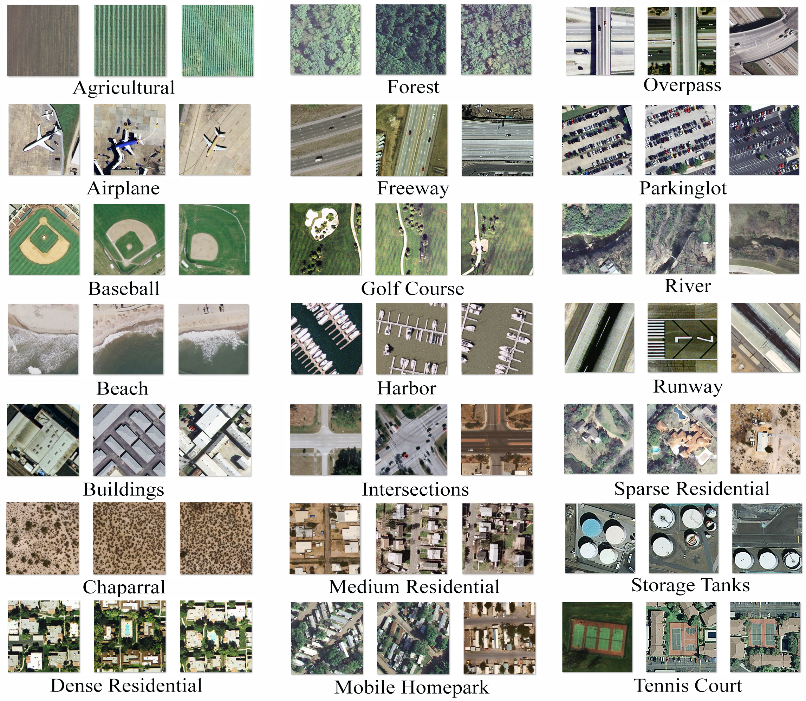
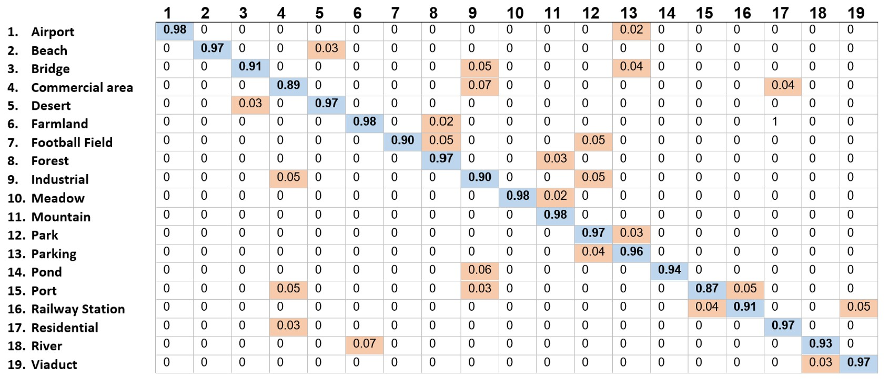
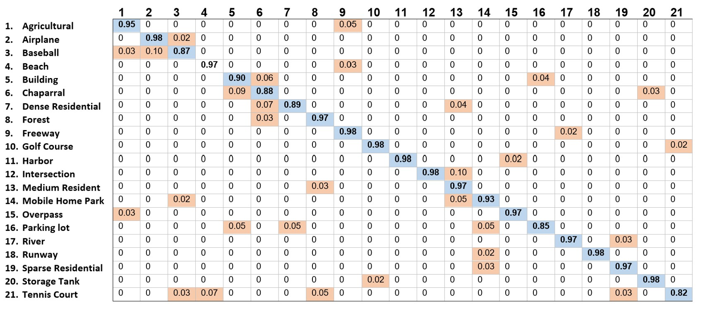

# MCE-RX-ST: A Hybrid Deep Learning Model for Visual Classification in Remote Sensing

# Journal Submission
This research has been submitted for peer review to **_The Journal of Supercomputing_** journal under the title:
## **MCE-RX-ST: A Hybrid Deep Learning Model for Visual Classification in Remote Sensing Using Minimum Cross Entropy, ResNeXt, and Swin Transformer**

## Citation
[](https://doi.org/10.5281/zenodo.14884749)

## Overview
This repository contains the implementation of **MCE-RX-ST**, a hybrid deep learning model integrating:
- **MCET Segmentation** for images mask
- **Swin Transformer** for extracting deep hierarchical features.
- **ResNeXt** for learning discriminative representations.
- **Feature Fusion** for improved classification accuracy.
- **Classifier** for final classification.

This model is designed for **remote sensing image classification** using datasets **WHURS19** and **UCMerced**.

## Project Structure
```
MCE-RX-ST/
│── main.m                     # Main script to run the model
│── load_datasets.m             # Loads the remote sensing datasets
│── compute_MCET_masks.m        # Computes MCET segmentation masks
│── extract_swin_features.m     # Extracts features using Swin Transformer
│── extract_resnext_features.m  # Extracts features using ResNeXt
│── fuse_feature_maps.m         # Fuses extracted features with segmentation masks
│── train_classifier.m          # Trains SVM classifier on fused features
│── plot_confusion_matrix.m     # Plots classification confusion matrix
│── adaptiveGumbelMCET.m        # MCET segmentation based on Gumbel distribution
│── swin_transformer_forward.m  # Runs Swin Transformer forward pass
│── resnext_forward.m           # Runs ResNeXt forward pass
│── swin_transformer_model.m    # Placeholder for Swin Transformer implementation
│── resnext_model.m             # Placeholder for ResNeXt implementation
│── README.md                   # Project documentation
```

## Installation & Requirements
This project requires MATLAB. Ensure the following toolboxes are installed:
- **Deep Learning Toolbox**
- **Image Processing Toolbox**
- **Statistics and Machine Learning Toolbox**
- 
## Datasets Used in This model: 
- **WHU-RS19 Dataset** (Remote sensing images covering 19 classes)
- **UCMerced Land Use Dataset** (21-class dataset of aerial images)
- •	[WHU-RS19]( https://huggingface.co/datasets/jonathan-roberts1/WHU-RS19)
- •	[UCMerced LandUse]( http://weegee.vision.ucmerced.edu/datasets/landuse.html)
## Direct Download WHU-RS19 Dataset: 
- https://drive.google.com/file/d/1NQ_gchcN96qsHpMWd4e6DS34Gijz2rTW/view?usp=drive_link
## UCMerced Land Use Dataset: 
- https://drive.google.com/file/d/1bBBWtNVdp5Kcpmr22uf5a5Wfx2D9Id6O/view?usp=drive_link

## Before Usage. How to fix LAPACK/BLAS loading error?
- Add two environment variables:
     ```bash
  setenv('BLAS_VERSION', 'mkl.dll')
  setenv('LAPACK_VERSION', 'mkl.dll')
   ```

## Usage
1. Clone the repository:
   ```bash
   git clone https://github.com/jumiawi/MCE-RX-ST.git
   cd MCE-RX-ST
   ```
2. Modify dataset paths in `main.m`:
   ```matlab
   whu_dir = 'path_to_WHURS19';
   ucm_dir = 'path_to_UCMerced';
   ```
3. Run `main.m` in MATLAB:
   ```matlab
   main
   ```
4. The script will:
   - Load and preprocess datasets
   - Compute MCET segmentation masks
   - Extract features using Swin Transformer and ResNeXt
   - Fuse feature maps
   - Train an SVM classifier
   - Evaluate classification performance

## Results

Sample images from the WHU-RS19 Dataset 


Sample images from the UC-Merced Land Use Dataset


Results for the WHU-RS19 Dataset Using the MCE-RX-ST 


Results for the UC-Merced Land Use Dataset Using the MCE-RX-ST 

## Citation
[](https://doi.org/10.5281/zenodo.14884749)

## License
This project is licensed under the MIT License.

